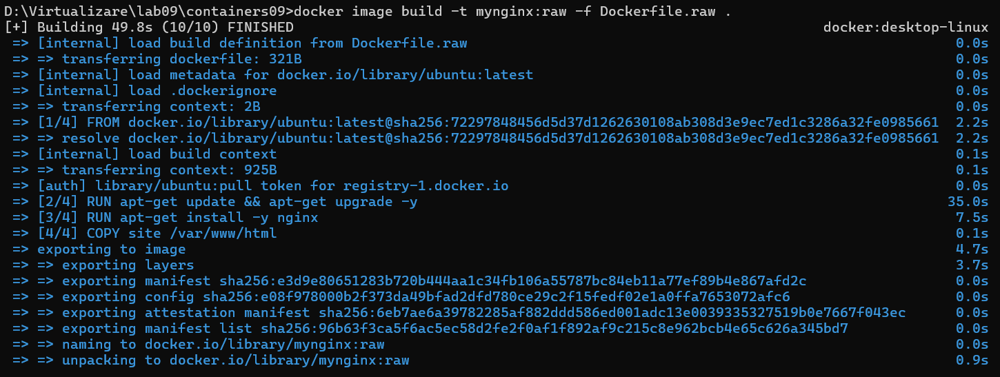
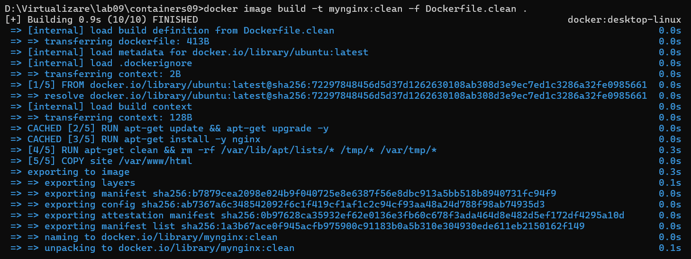
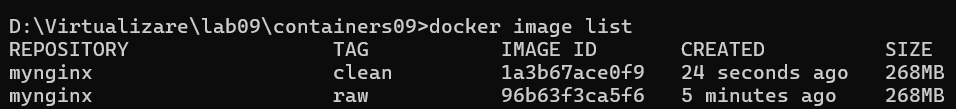
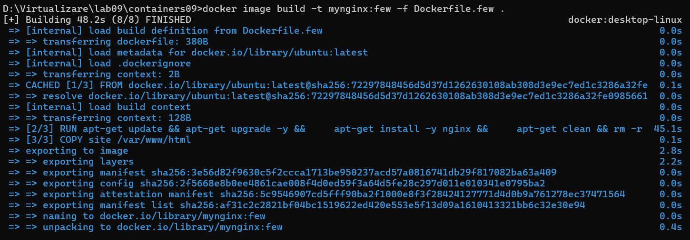
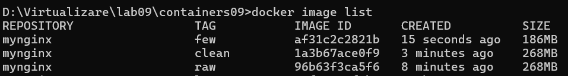
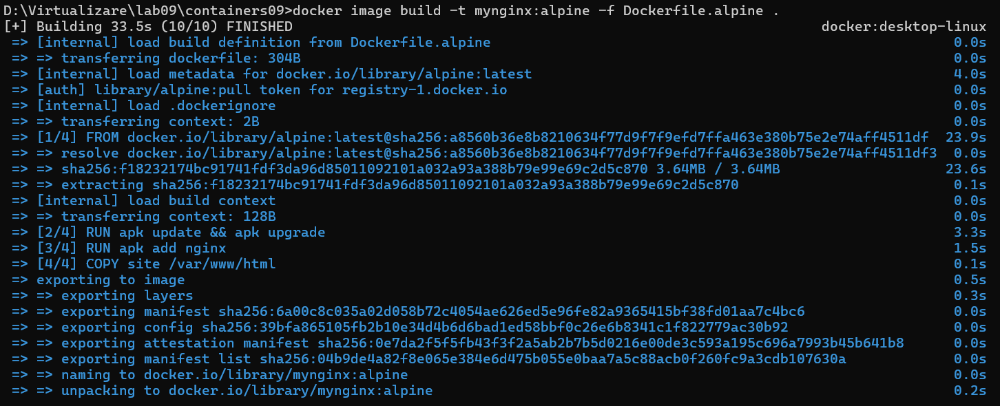
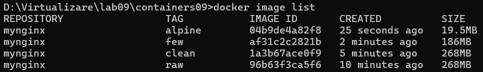
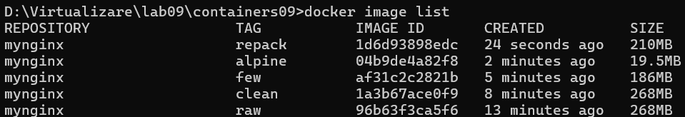
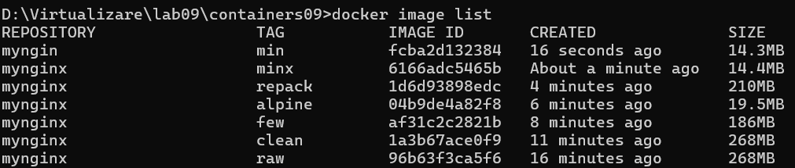

# Laborator 9: Optimizarea Imaginilor în Docker

## Scopul lucrării
Scopul lucrării este de a se familiariza cu metodele de optimizare a imaginilor în Docker pentru a reduce dimensiunea acestora și a îmbunătăți performanța în utilizare.

## Sarcina
Compararea diferitelor metode de optimizare a imaginilor:
1. Ștergerea fișierelor temporare și a dependențelor neutilizate.
2. Reducerea numărului de straturi.
3. Utilizarea unei imagini de bază minime.
4. Repachetarea imaginii.
5. Utilizarea tuturor metodelor.

## Descrierea pașilor de realizare a lucrării

### 1. Crearea imaginii inițiale
- Am scis `Dockerfile.raw` utilizând următorul conținut:
    ```dockerfile
    # create from ubuntu image
    FROM ubuntu:latest

    # update system
    RUN apt-get update && apt-get upgrade -y

    # install nginx
    RUN apt-get install -y nginx

    # copy site
    COPY site /var/www/html

    # expose port 80
    EXPOSE 80

    # run nginx
    CMD ["nginx", "-g", "daemon off;"]
    ```
- Am construit imaginea cu numele mynginx:raw:

    

### 2. Ștergerea fișierelor temporare și dependențelor neutilizate
- Am scris `Dockerfile.clean`, unde am modificat Dockerfile pentru a include comenzi de ștergere a fișierelor temporare generate în timpul instalării pachetelor (ex. cache-ul apt și fișierele din /tmp și /var/tmp).:
    ```dockerfile
    # create from ubuntu image
    FROM ubuntu:latest

    # update system
    RUN apt-get update && apt-get upgrade -y

    # install nginx
    RUN apt-get install -y nginx

    # remove apt cache
    RUN apt-get clean && rm -rf /var/lib/apt/lists/* /tmp/* /var/tmp/*

    # copy site
    COPY site /var/www/html

    # expose port 80
    EXPOSE 80

    # run nginx
    CMD ["nginx", "-g", "daemon off;"]
    ```
- Am construit și vizualizat imaginea unde putem observa ca dimensiunea nu s-a modificat din cauza că fiecare comandă dintr-un Dockerfile creează un strat nou. Dacă ștergem fișiere temporare într-un strat separat, straturile anterioare care conțin acele fișiere sunt încă păstrate în istoria imaginii, la urmatorul pas vom vedeam cum putem reduce numarul de straturi:

    

    

### 3. Reducerea numărului de straturi
- Am scris `Dockerfile.few`, unde am combinat toate comenziile din Dockerfile care actualizează sistemul, instalează Nginx și șterg fișierele temporare într-un singur strat folosind operatorul &&:
    ```dockerfile
    # create from ubuntu image
    FROM ubuntu:latest

    # update system
    RUN apt-get update && apt-get upgrade -y && \
        apt-get install -y nginx && \
        apt-get clean && rm -rf /var/lib/apt/lists/* /tmp/* /var/tmp/*

    # copy site
    COPY site /var/www/html

    # expose port 80
    EXPOSE 80

    # run nginx
    CMD ["nginx", "-g", "daemon off;"]
    ```
- Am construit și vizualizat imaginea unde putem observa ca dimensiunea este mai mică în comparație cu prima:

    

    

### 4. Utilizarea unei imagini de bază minime
- Am scris `Dockerfile.alpine`, unde am schimbat imaginea de bază din ubuntu:latest în alpine:latest, care este o imagine Docker minimalistă, optimizată pentru spațiu:
    ```dockerfile
    # create from alpine image
    FROM alpine:latest

    # update system
    RUN apk update && apk upgrade

    # install nginx
    RUN apk add nginx

    # copy site
    COPY site /var/www/html

    # expose port 80
    EXPOSE 80

    # run nginx
    CMD ["nginx", "-g", "daemon off;"]
    ```
- Am construit și vizualizat imaginea unde putem observa ca dimensiunea este cu mult mai mică în comparație cu prima:

    

    

### 5. Repachetarea imaginii
- Am exportat un container creat din imaginea mynginx:raw și am importat conținutul său într-o nouă imagine mynginx:repack, eliminând metadatele stratificate:
    ```bash
    docker container create --name mynginx mynginx:raw
    docker container export mynginx | docker image import - mynginx:repack
    docker container rm mynginx
    docker image list
    ```

    

### 6. Utilizarea tuturor metodelor
- Am creat o imagine Dockerfile.min care combină toate metodele: utilizarea unei imagini de bază minimale (Alpine), combinarea comenzilor pentru a reduce numărul de straturi și ștergerea fișierelor temporare:
    ```dockerfile
    # create from alpine image
    FROM alpine:latest

    # update system, install nginx and clean
    RUN apk update && apk upgrade && \
        apk add nginx && \
        rm -rf /var/cache/apk/*

    # copy site
    COPY site /var/www/html

    # expose port 80
    EXPOSE 80

    # run nginx
    CMD ["nginx", "-g", "daemon off;"]
    ```

    ```bash
    docker image build -t mynginx:minx -f Dockerfile.min .
    docker container create --name mynginx mynginx:minx
    docker container export mynginx | docker image import - mynginx:min
    docker container rm mynginx
    docker image list
    ```

    

## Întrebări

### 1. Care metoda de optimizare a imaginilor vi se pare cea mai eficientă?
Metoda cea mai eficientă este utilizarea tuturor metodelor de optimizare combinate, astfel cum este realizată în imaginea mynginx:min. Aceasta implică utilizarea unei imagini de bază minimale (ex. curent Alpine), reducerea numărului de straturi și ștergerea fișierelor temporare și a cache-ului într-un singur strat, pentru a obține o imagine compactă și eficientă.

### 2. De ce curățirea cache-ului pachetelor într-un strat separat nu reduce dimensiunea imaginii?
În Docker, fiecare comandă dintr-un Dockerfile creează un strat nou. Dacă ștergerea cache-ului pachetelor se efectuează într-un strat separat, straturile anterioare care conțin cache-ul sunt păstrate în continuare în imagine. Pentru a evita acest lucru, toate comenzile de instalare și curățare trebuie combinate într-un singur strat folosind operatorul &&.

### 3. Ce este repachetarea imaginii?
Repachetarea imaginii implică exportarea conținutului unui container creat pe baza unei imagini existente și importarea acestuia într-o nouă imagine Docker. Acest proces elimină metadatele inutile și straturile intermediare, reducând dimensiunea imaginii rezultate.

## Concluzie

Aceasta lucrarea de laborator a demonstrat importanța utilizării tehnicilor eficiente pentru reducerea dimensiunii imaginilor și îmbunătățirea performanței acestora. Am început cu o imagine de bază neoptimizată și am aplicat diverse metode pentru a analiza impactul fiecăreia asupra dimensiunii.